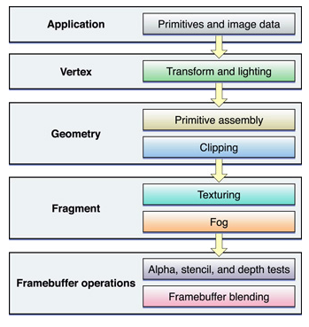
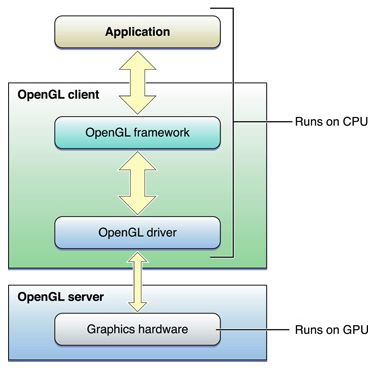
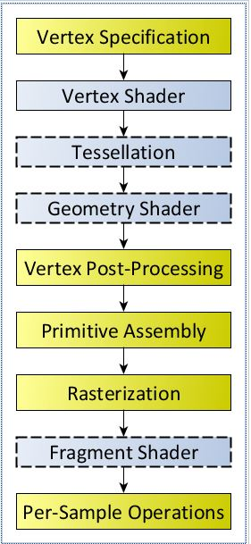
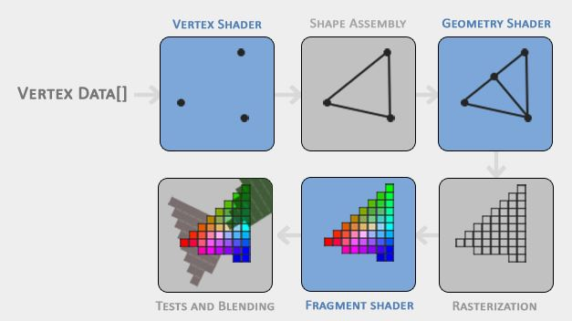
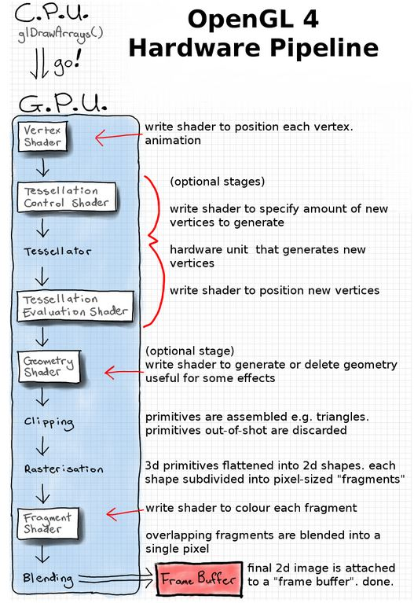

# OpenGL Notes
- [Introduction](#Introduction)
- [How it works?](#How-it-works?)
- [Rendering Pipeline](#Rendering-Pipeline)
- [Shaders](#Shaders)
- [Objects](#Objects)
- [Application Design Strategies](#Application-Design-Strategies)
- [Common Mistakes](#Common-Mistakes)
- [References](#References)

## Introduction
OpenGL is a cross-platform specification for graphics and its applications. It is usually considered as an API but indeed it is a specification. It does not provide the implementation details but the input/output and the side effects of the functions calls are specified. 

As stated in the Khronos' [documentation](https://www.khronos.org/opengl/wiki/Portal:OpenGL_Concepts):
> OpenGL is the name for the specification that describes the behavior of a rasterization-based rendering system. It defines the API through which a client application can control this system. The OpenGL rendering system is carefully specified to make hardware implementations allowable.

Hardware vendors, the people who make GPUs, are responsible for writing implementations of the OpenGL rendering system. Their implementations, commonly called "drivers", translate OpenGL API commands into GPU commands. If a particular piece of hardware is unable to implement all of the OpenGL specification via hardware, the hardware vendor must still provide this functionality, typically via a software-based implementation of the features missing from hardware. 

### Context
The context contains all the information that will be used by the OpenGL system to render, when the system is given a rendering command.

Contexts are particular to that application and the same context can only belong to one application. However, an application might have multiple context.

OpenGL functions operate on the **current** and the **owner** context. In other words, the function pointers retrieved from one context should NOT be used in another context.

### OpenGL is a state-machine
The OpenGL context contains the information to be used by the rendering system and this information is named as **State**. The `state` is simply some value stored in the context.

The OpenGL context stores multiple states and each of them can be uniquely identified through given unique identifiers. There are different types of states i.e. numerical value, array, string.

When a context is created, every piece of state is initialized with a well-defined default value. The list of identifiers can be found from the state table.

### OpenGL functions
It can grouped into three:
1. State setting into the context.
2. Query the state
3. Render given the current state of the context.

### Objects
Some OpenGL state representations are handled through objects. This allows groups of state to be bundled together and can be controlled/reset with single command. 
Most of the OpenGL objects bundles multiple context states together.

There is a convention for naming, identifying, creating, using and deleting the objects.:
- Object names (id) are represented through `GLuint`. These are identifiers.
- `glGen*` functions are used to generate objects.
- Those objects are deleted using `glDelete*` functions by passing the appriopriate ids.
- Since the objects bundles the context states and those state(s) exist within the context, those objects first are required to be bound to the context in order to modify the object or use it to render something. This is done with `glBind*` functions.
- Any function modify/query/render the internal state of the context will also modify/query/use to render the corresponding object's internal state.

`Object 0` is a special form of an object but might have different meanings for different object types:
- For many objects, it represents `not an object` - like `nullptr`.
- For few object types, it means that `this object is a default object which can NOT be destroyed.`.
- With the exception of the Framebuffers, it should be treated as `invalid object - null`.

### Commands and Synchronization
OpenGL usually specifies the behavior of commands but the implementation is all up-to graphics driver's manufacturer's. Normally, in order to achieve a graphics task, the OpenGL commands are executed in an order ( sequence) and every subsequent command must behave as if all prior commands have completed and their contents are visible.

However, as previously stated the implementations might differ and most of the time, they are handled asynchronously. For instance, when a rendering function returns, it is most likely not even started yet and so not finished. As long as you don't query any state or object which is part of the rendering process, it is hard to tell the differece.

The implementations still must make rendering look synchronous while even being as async as possible. For best performance:
- Avoid querying state that is part of the rendering process/commands.
- Avoid changing the contents of the objects that are part of the rendering process.

### Rendering Pipeline
It is best explained in the documentation:

> The Rendering Pipeline is the sequence of steps that are taken by the OpenGL rendering system when the user issues a Drawing Command. The pipeline is a sequential series of steps, where each step performs some computation and passes its data to the next step for further processing.
The OpenGL specification is very clear on the order in which objects are rendered. Specifically, objects are rendered in the exact order the user provides. While implementations are free to adjust the order internally, the rendered output must be as if it were processed in order.

### Shaders
Certain stages of the rendering pipeline is programmable and they are called `Shader Stage`. The programs that are executed by those stages are called `Shader`. Shaders are writtern in `OpenGL Shading Language`. 

### Framebuffer
It is a collection of buffers that can be used as the destination for rendering. It has two types:
- Default Framebuffer (provided by the context): It is part of the context and usually represent a window or display device.
- User created: Framebuffer Objects(FBOs) -> These framebuffer objects reference images from either `Textures` or `Renderbuffers`; they are never directly visible.

## How it works?
Your application sends vertex and image data, configuration and state changes, and rendering commands to OpenGL. Vertices are processed, assembled into primitives, and rasterized into fragments. Each fragment is calculated and merged into the framebuffer. The pipeline model is useful for identifying exactly what work your application must perform to generate the results you want. OpenGL allows you to customize each stage of the graphics pipeline, either through customized shader programs or by configuring a fixed-function pipeline through OpenGL function calls.

  

Another way to visualize OpenGL is as a client-server architecture. OpenGL state changes, texture and vertex data, and rendering commands must all travel from the application to the OpenGL client. The client transforms these items so that the graphics hardware can understand them, and then forwards them to the GPU. Not only do these transformations add overhead, but the bandwidth between the CPU and the graphics hardware is often lower than other parts of the system.

  

## Rendering Pipeline
The process of transforming 3D coordinates to 2D pixels is managed by the graphics pipeline of OpenGL. The rendering pipeline is initiated when you perform a rendering operation. It takes the input as a set of 3D coordinates and transforms these to colored 2D pixels on your screen. 

It can be considered as the sequence of steps that OpenGL takes when rendering objects. It consists of several steps where each step requires the output of the previous step as its input.

  

All of these steps are highly specialized (they have one specific function) and they take place in `GPU` so they can easily be executed in parallel. Because of their parallel nature, graphics cards of today have thousands of small processing cores to quickly process your data within the graphics pipeline. 

  

Also, these `GPU` cores are capable of running small pieces of programs and each step of the pipeline runs those small programs. These small programs are called shaders.

> Rendering operations require the presence of a properly-defined vertex array object and a linked Program Object or Program Pipeline Object which provides the shaders for the programmable pipeline stages.

### Core-profile vs. Immediate mode
- **Immediate mode (Fixed- pipeline)**: Pipeline is fixed; developers are limited to existing functions. 
- **Core-Profile**: Pipeline is modular; development is flexible by editing parts of pipeline through shaders

## Shaders
Shaders are mini-programmes that define a style of rendering. They are compiled to run on the specialised GPU (graphics processing unit). The GPU has lots of processors specialised for floating-point operations. Each rendering stage can be split into many separate calculations - with one calculation done on each GPU processor; transform each vertex, colour each tiny square separately, etc. This means that we can compute a lot of the rendering in parallel - which makes it much faster than doing it with a CPU-based software renderer where we only have 1-8 processors (in the graphics world, "hardware" implies the graphics adapter).

Shaders are a way of re-programming the graphics pipeline. If we wanted to use a different colouring method for the cube in the image, or have an animated, spinning cube, we could tell OpenGL to switch to using a different shader programme. Older OpenGL APIs had pre-canned functions like glLight() for driving the rendering model. We call this the fixed-function pipeline ("fixed" because it's not re-programmable). These functions no longer exist, and we have to write the lighting equations ourselves in shaders. In OpenGL 4 we can write a shader to control many different stages of the graphics pipeline: 

  

## Objects

## [Application Design Strategies](https://developer.apple.com/library/archive/documentation/GraphicsImaging/Conceptual/OpenGL-MacProgGuide/opengl_designstrategies/opengl_designstrategies.html#//apple_ref/doc/uid/TP40001987-CH2-SW6)
TODO

## [Common Mistakes](https://www.khronos.org/opengl/wiki/Common_Mistakes)
TODO

## References
- [OpenGL Wiki](https://www.khronos.org/opengl/wiki)
- [Khronos - OpenGL Concepts](https://www.khronos.org/opengl/wiki/Portal:OpenGL_Concepts)
- [Apple's OpenGL documentation](https://developer.apple.com/library/archive/documentation/GraphicsImaging/Conceptual/OpenGL-MacProgGuide/opengl_designstrategies/opengl_designstrategies.html#//apple_ref/doc/uid/TP40001987-CH2-SW12)
- [Khronos - Rendering Pipeline Overview](https://www.khronos.org/opengl/wiki/Rendering_Pipeline_Overview)
- [Anton's OpenGL 4 Tutorials](https://antongerdelan.net/opengl/)
- [learnopengl.com](https://learnopengl.com/)
