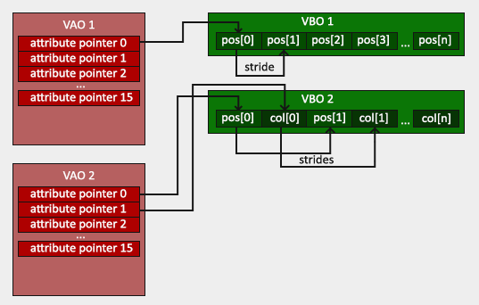
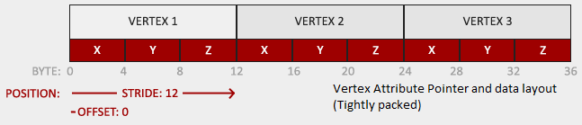
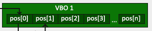
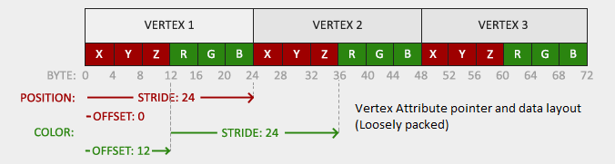
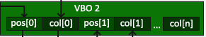
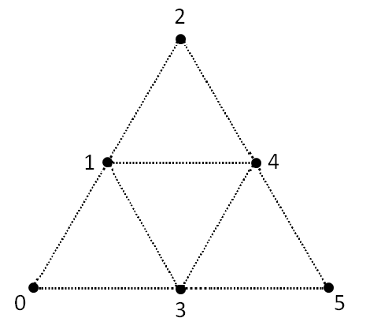
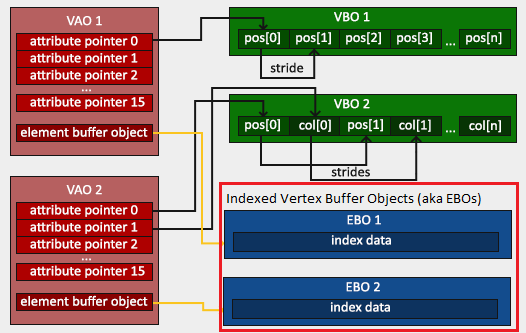

# OpenGL Objects
- [What is an OpenGL object?](#What-is-an-OpenGL-object?)
- [Object Types](#Object-Types)
- [Buffer Objects](#Buffer-Objects)
- [Vertex Objects](#Vertex-Objects)
    - [What is vertex](#What-is-vertex?)
    - [Vertex attribute](#Vertex-attribute)
    - [Vertex Buffer Object (VBO)](#Vertex-Buffer-Object-(VBO))
    - [Vertex Array Object (VAO)](#Vertex-Array-Object-(VAO))
    - [How does this work?](#How-does-this-work?)
    - [Best practices for working with Vertex Data](#Best-practices-for-working-with-Vertex-Data)
- [Indexed Vertex Buffer Object](#Indexed-Vertex-Buffer-Object-(aka-Element-Buffer-Object))
- [Framebuffer Objects](#Framebuffer-Objects)
- [References](#References)

## What is an OpenGL object?
OpenGL object is an abstraction to hold some state. That's all. It has the following features:
- When the objects are bound a context, the state they contain is mapped into the context's state.
- If it is not bound, the contained state is NOT mapped into the context.
- The changes made to the context's state will be reflected to the corresponding object's state.
- Functions that act on the context' state will use the corresponding object's state.

There is a common (generic) pattern for every object type in OpenGL for creation, binding, using, unbinding and deletion.
The details will be given for seperately for each object type.

## Object Types
- Regular: Buffer, Query, RenderBuffer, Sampler, Texture
- Container: Framebuffer, PRogram pipeline objects, Transform Feedback objects, Vertex Array Object

## Buffer Objects
These are OpenGL objects that store an array of unformatted memory allocated by the context AKA the GPU. This memory location can be used to store data.

The general use for the `Buffer Objects` is as defined in the [offical documentation](https://www.khronos.org/opengl/wiki/Buffer_Object):
> Most of the uses of buffer objects involve binding them to a certain target, which other OpenGL operations will detect the bound buffer and then use the data stored in that buffer in some way, either reading or writing values in a well-defined format. 

Before things get confusing, I think it is better to stop here with the definition of the `Buffer Object` and jump to other definitions.

## Vertex Objects

### What is Vertex?
A `vertex` consists of one or more attributes such as the position, color, normal and/or texture coordinates. Each attribute in the vertex data corresponds to an attribute variable that acts as an input to the vertex shader.

> Based on the above explanation, a vertex do NOT ONLY represent a set of coordinates for the position as we usually think in the geometry field. It has slightly different meaning in OpenGL with some additional flavours.

In short, vertex information is represented through one or more vertex attributes.

### Vertex attribute
A `vertex attribute` is a vector consisting of from one to four components and all components share a common data type (i.e. the color vertex attribute might be defined as a collection of four `GLubyte` components (red, green, blue, alpha)).

The vertex attributes are numbered from 0 to `GL_MAX_VERTEX_ATTRIBS` - 1. Each attribute can be enabled or disabled for array access. When an attribute's array access is disabled, any reads of that attribute by the vertex shader will produce a constant value instead of a value pulled form the array.

### Vertex Buffer Object (VBO)
`VBO` is a memory buffer that belongs to the GPU as all other buffer objects but it is designed to hold information about vertices. It can store coordinates, colors, normals, texcoords, indices etc.

In the `immediate-mode` days of OpenGL, the vertex data was defined in the client memory and was copied one-by-one to server side each time we draw. With VBOs, now the required memory is allocated in the server side before drawing starts and sits there until it is used. This brings huge performance achievement and no more copy required back and forth during drawing.

A VBO can hold information for one or multiple vertices and a vbo can be specialized for specific type of data i.e. colors or coordinates. For instance, VBO1 can hold only coordinate data for one/multiple vertices while VBO2 is holding color data for those vertices.

A VBO can be used to hold both `static` or `dynamic` vertex data.

### Vertex Array Object (VAO)
A `Vertex Array Object` is an object which contains data for one or more vertex using `vertex attribute pointers` which points to a memory location controlled by the `Vertex Buffer Objects (VBO)`. It is designed to store the information for a complete rendered object.

It has the following features:
- Uses the VBO(s) as the source of the vertex data.
- Also stores the format of the vertex data.
- Does `NOT` copy, freeze or store the contents of the referenced buffers so if you change the data in the buffers referenced by an existing `VAO`, those changes will be seen by the users of that `VAO`.
- VAO(s) can `NOT` be shared between OpenGL contexts.
- VAOs are responsible to report its layout to the shaders for rendering. Its layout defined by VBO which consists of the vertex attributes.

### The relationship between VAO and VBO
Since VAO is a client side functionality, it provides a great advantage for flexibility and dynamic control. However, it has performance penalty. Thankfully, this can be overcome by using VBO(s) which provides access to the server (VRAM) storage.

The memory required to hold vertex attribute information (data) is wrapped under VBO and that memory piece is accessible through `vertex attribute pointer(s)` which is wrapped by VAO(s). Vertex attribute pointers sits in the client side but they point to a memory location which belongs to the server side.

<p align="center">
  
</p>

Best of both worlds are achieved by using VBO and VAO together:
> The vertex data is stored in `VRAM` (fast) but also can be controlled (reading/updating) from the client side.

### How does this work?
Until now, we've only discussed about the theory and let's bring some pieces together. There are several ways to implement this.

#### Common Rules
- `glVertexAttribPointer()` defines the layout of the VBO within the VAO.
- Always bind the corresponding VBO before making a call to `glVertexAttribPointer()`.
- Calling `glBindBuffer()` will NOT do anything to VAO's state.

#### Definitions
- **Tightly-packed VBO**: A VBO is called to be `tightly-packed` if it holds single vertex attribute with ONLY one specific info i.e. coordinates, colors, textures NOT multiple of them together. Another way of saying this is that `there is only one vertex attribute for each vertex and there is only one pointer for that attribute`.

This can be achieved by defining correct vertex data attribute pointer and setting `stride` argument to `0` in `glVertexAttribPointer()` function call.

<p align="center">
  
</p>

<p align="center">
  
</p>

- **Loosely-packed VBO**: A VBO can hold multiple different types of vertex data at the same time. However, these different set of datas should be marked (indexed) properly to let VAO (eventually Vertex Shader) know. This type of packed VBO(s) is called `Loosely-packed VBO(s)`. Another way of implying this is: `Multiple vertex attributes exist for each vertex and each attribute is accessible with different pointers and appropriate indexing.`

> This is not a part of an official or community accepted terminology. I have just throw it away :)

In order to pack different types of vertex data into one VBO, `glVertexAttribPointer()` and `glEnableVertexAttribArray()` should be called with proper arguments especially `index` and `stride` to avoid overlap between different vertex data types.

<p align="center">
  
</p>

<p align="center">
  
</p>

#### **Tightly-packed single VBO - single VAO**: 
```cpp
// 1. Define the vertex data
// Here we only have {X,Y,Z} coordinates
GLfloat coordinates[] = { 
    0.0f,   0.5f,   0.0f, 
    0.5f,   -0.5f,  0.0f, 
    -0.5f,  -0.5f,  0.0f 
};

// 2. Generate a vbo for the coordinates
GLuint coord_vbo;
glGenBuffers(1, &coord_vbo);

// 3. Bind the coord_vbo to the context
glBindBuffer(GL_ARRAY_BUFFER, coord_vbo);

// 4. Allocate and store the vertex data (coordinates only in this case) in the GPU side
// for the coord_vbo VBO object
// At this point, the most recently bound vbo is coord_vbo so 
// the allocation and data storage for given coordinates will be associated to the coord_vbo.
glBufferData(GL_ARRAY_BUFFER, 9 * sizeof(GLfloat), coordinates, GL_STATIC_DRAW);

// 5. Generate and bind VAO
GLuint vao;
glGenVertexArrays(1, &vao);
glBindVertexArray(vao);

// 6. Define and associate the vertex attribute to the vbo

// Before doing so, you have to make sure that the corresponding vbo is bound
glBindBuffer(GL_ARRAY_BUFFER, coord_vbo);
// Generate the vertex attribute (tightly packed)
// since it is tightly packed, stride = 0
glVertexAttribPointer(0, 3, GL_FLOAT, GL_FALSE, 0, NULL);
// Enable it's index for the most recently bound vbo (coord_vbo)
glEnableVertexAttribArray(0);

// 7. Bind the VBO 0
// This does nothing between the object vbo and associated attributes
// We are letting know OpenGL that a special VBO which is VBO-0 is now bound to the context.
glBindBuffer(GL_ARRAY_BUFFER, 0);
// From this point, we can safely unbind the vbo buffer object.

// 8. Unbind the VAO
// If we don't make use of the VAO(s) after, we can safely unbind them by binding special VAO-0.
glBindVertexArray(0);
// After this point, do NOT call any function that modifies the VAO state.
```
#### **Tightly-packed multiple VBOs - single VAO**: 
Multiple VBOs can be associated to a single VAO and each VBO can be tightly-packed. The major difference is that vertex attribute arrays should be attached to unique indexes.

```cpp
// 1
GLfloat coordinates[] = { 
    0.0f,   0.5f,   0.0f, 
    0.5f,   -0.5f,  0.0f, 
    -0.5f,  -0.5f,  0.0f 
};

GLfloat colours[] = { 
    1.0f, 0.0f, 0.0f, 
    0.0f, 1.0f, 0.0f, 
    0.0f, 0.0f, 1.0f 
};

// 2,3 & 4
GLuint coord_vbo;
glGenBuffers(1, &coord_vbo);
glBindBuffer(GL_ARRAY_BUFFER, coord_vbo);
glBufferData(GL_ARRAY_BUFFER, 9 * sizeof(GLfloat), coordinates, GL_STATIC_DRAW);

GLuint colours_vbo;
glGenBuffers(1, &colours_vbo);
glBindBuffer(GL_ARRAY_BUFFER, colours_vbo);
glBufferData(GL_ARRAY_BUFFER, 9 * sizeof(GLfloat), colours, GL_STATIC_DRAW);

// 5. Generate and bind VAO
GLuint vao;
glGenVertexArrays(1, &vao);
glBindVertexArray(vao);

// 6.
glBindBuffer(GL_ARRAY_BUFFER, coord_vbo);
glVertexAttribPointer(0, 3, GL_FLOAT, GL_FALSE, 0, NULL);
glEnableVertexAttribArray(0);
glBindBuffer(GL_ARRAY_BUFFER, 0); // not required

// Since we have multiple vbos to be linked to single vao, 
// each vertex attrib array should have unique indexes.
glBindBuffer(GL_ARRAY_BUFFER, colours_vbo);
glVertexAttribPointer(1, 3, GL_FLOAT, GL_FALSE, 0, NULL);
glEnableVertexAttribArray(1);
glBindBuffer(GL_ARRAY_BUFFER, 0); // not required

// 7.
glBindVertexArray(0);
```
Multiple VBOs can also be generated and used as follows:
```cpp
// ... same as before

// 2,3 & 4
GLuint vbos[2];
glGenBuffers(2, vbos); // Generate multiple vbos

// coordinates
glBindBuffer(GL_ARRAY_BUFFER, vbos[0]); // use through
glBufferData(GL_ARRAY_BUFFER, 9 * sizeof(GLfloat), coordinates, GL_STATIC_DRAW);

// colors
glBindBuffer(GL_ARRAY_BUFFER, vbos[1]);
glBufferData(GL_ARRAY_BUFFER, 9 * sizeof(GLfloat), colors, GL_STATIC_DRAW);

// rest is the same
```
#### **Loosely-packed VBO(s)**:
```cpp
// 1. Define vertices
GLfloat vertices[] = {
    // Coord                // Colors           // texture coordinates
    0.0f,   0.5f,   0.0f,   1.0f, 0.0f, 0.0f,   0.5f, 1.0f,     // Vertex 1
    0.5f,   -0.5f,  0.0f,   0.0f, 1.0f, 0.0f,   1.0f, 0.0f,     // Vertex 2
    -0.5f,  -0.5f,  0.0f,   0.0f, 0.0f, 1.0f,   0.0f, 0.0f      // Vertex 3
};

// 2. Generate and bind Vertex Array Object (VAO) first
GLuint vao;
glGenVertexArrays(1, &vao);
glBindVertexArray(vao);

// 3. Generate and bind the Vertex Buffer Object (VBO)

/* a vertex buffer object (VBO) is created here. this stores an array of
data on the graphics adapter's memory. in our case - the vertex points */
GLuint vbo;
// Generate 1 buffer and associate it with vbo
glGenBuffers(1, &vbo);
// Bind the buffer to the context for the vertex attribute purpose. 
glBindBuffer(GL_ARRAY_BUFFER, vbo);

// 4. Allocate and store the vertex data in the GPU memory for `vbo` buffer object 
// At this point, vbo named buffer is bound
glBufferData(GL_ARRAY_BUFFER, 24 * sizeof(GLfloat), vertices, GL_STATIC_DRAW);

// 5. Define and enable vertex attributes
// At this point, most recently bound VBO is the object named vbo so 
// all defined attributes from this point will be associated to the 'vbo' VBO :)
// The association between the index and VBO object is made at this stage.

// Vertex attribute at index 0
glVertexAttribPointer(0, 3, GL_FLOAT, GL_FALSE, 8 * sizeof(GLfloat), (GLvoid*)0);
glEnableVertexAttribArray(0); // 0 = index of the vertex attribute to be enabled

// Vertex attribute at index 1
glVertexAttribPointer(1, 3, GL_FLOAT, GL_FALSE, 8 * sizeof(GLfloat), (GLvoid*)(3 * sizeof(GLfloat)));
glEnableVertexAttribArray(1);

// Vertex attribute at index 2
glVertexAttribPointer(2, 2, GL_FLOAT, GL_FALSE, 8 * sizeof(GLfloat), (GLvoid*)(6 * sizeof(GLfloat)));
glEnableVertexAttribArray(2);

// 6. Bind the VBO 0
// This does nothing between the object vbo and associated attributes
// We are letting know OpenGL that a special VBO which is VBO-0 is now bound to the context.
glBindBuffer(GL_ARRAY_BUFFER, 0);
// From this point, we can safely unbind the vbo buffer object.

// 7. Unbind the VAO
// If we don't make use of the VAO(s) after, we can safely unbind them by binding special VAO-0.
glBindVertexArray(0);
// After this point, do NOT call any function that modifies the VAO state.
```
#### **Multiple VBO(s) attached to multiple VAO(s)**:
Regardless of having `tightly` or `loosely` packed VBO(s), a VAO can be defined for each VBO.

```cpp
/*
Code snippet from:
https://github.com/JoeyDeVries/LearnOpenGL/blob/master/src/1.getting_started/2.4.hello_triangle_exercise2/hello_triangle_exercise2.cpp
*/

// set up vertex data (and buffer(s)) and configure vertex attributes
// ------------------------------------------------------------------
float firstTriangle[] = {
    -0.9f, -0.5f, 0.0f,  // left 
    -0.0f, -0.5f, 0.0f,  // right
    -0.45f, 0.5f, 0.0f,  // top 
};
float secondTriangle[] = {
    0.0f, -0.5f, 0.0f,  // left
    0.9f, -0.5f, 0.0f,  // right
    0.45f, 0.5f, 0.0f   // top 
};

unsigned int VBOs[2], VAOs[2];
glGenVertexArrays(2, VAOs); // we can also generate multiple VAOs or buffers at the same time
glGenBuffers(2, VBOs);

// first triangle setup
// --------------------
glBindVertexArray(VAOs[0]);
glBindBuffer(GL_ARRAY_BUFFER, VBOs[0]);
glBufferData(GL_ARRAY_BUFFER, sizeof(firstTriangle), firstTriangle, GL_STATIC_DRAW);
glVertexAttribPointer(0, 3, GL_FLOAT, GL_FALSE, 3 * sizeof(float), (void*)0);	// Vertex attributes stay the same
glEnableVertexAttribArray(0);

// glBindVertexArray(0); // no need to unbind at all as we directly bind a different VAO the next few lines
// second triangle setup
// ---------------------
glBindVertexArray(VAOs[1]);	// note that we bind to a different VAO now
glBindBuffer(GL_ARRAY_BUFFER, VBOs[1]);	// and a different VBO
glBufferData(GL_ARRAY_BUFFER, sizeof(secondTriangle), secondTriangle, GL_STATIC_DRAW);
glVertexAttribPointer(0, 3, GL_FLOAT, GL_FALSE, 0, (void*)0); // because the vertex data is tightly packed we can also specify 0 as the vertex attribute's stride to let OpenGL figure it out
glEnableVertexAttribArray(0);
// glBindVertexArray(0); // not really necessary as well, but beware of calls that could affect VAOs while this one is bound (like binding element buffer objects, or enabling/disabling vertex attributes)

```

### Best practices for working with Vertex Data
Apple, Inc. has a detailed documentation on this topic. Please follow the [link](https://developer.apple.com/library/archive/documentation/GraphicsImaging/Conceptual/OpenGL-MacProgGuide/opengl_vertexdata/opengl_vertexdata.html#//apple_ref/doc/uid/TP40001987-CH406-SW3).


## Indexed Vertex Buffer Object (aka Element Buffer Object)
In order to better understand what an `Element Buffer Object (EBO)` is, it'd be better to explain the indexing logic.

### Indexing
In the previous explanations, each vertex data is defined separately because they don't share any state (color, position, etc.) in common. If this is the case then data definition for each vertex is inevitable and desired.

However, in some cases, some vertieces can be shared to render a geometry. Consider the following case:

<p align="center">
  
</p>

As seen above, some vertices are located at the same position with same color so defining a vertex data (so vertex attributes) for each is not necessary and not benefical for performance. For this reason, an appriopriate vertex buffer object should be used and it is called `Indexed Vertex Buffer Object`.

Regular VBOs are wrappers for memory location in the server side and hold the vertex attribute pointer values. Indexed VBOs are similar. They are wrappers for memory locations to hold vertex index data.

To sum up, if there is an overlap between vertex data values for some vertices, using indexing is a better practice. You can represent the same geometry and so handle the rendering process with less number of vertices.

<p align="center">
  
</p>

### How does it work?
The vertex data is stored through vertex attribute pointer within the VAO and the attribute pointer points a memory location in the video(server) side which is wrapped by the VBO. Now, we have an additional information to be stored and those are `indexes` for those vertex attributes.

```cpp
/*
Define some vertex attributes first
*/

// Generate data for indices
GLuint indices[] = {  // note that we start from 0!
    0, 1, 3,  // first Triangle
    1, 2, 3   // second Triangle
};

// 5. Generate and bind VAO
GLuint vao;
glGenVertexArrays(1, &vao);
glBindVertexArray(vao); //Bind Vao First

// Indexed VBO
// Since they are directly stored in VAO, the corresponding 
// VAO should Be bound first.
GLuint indexed_vbo;
glGenBuffers(1, &indexed_vbo);
glBindBuffer(GL_ELEMENT_ARRAY_BUFFER, indexed_vbo);
glBufferData(GL_ELEMENT_ARRAY_BUFFER, sizeof(indices), indices, GL_STATIC_DRAW);

```
> RULE: Since Indexed VBOs are part of VAO storage, they should be bound and data defined after the owner VAO is bound. Bind the owner VAO first.

`gl*Draw*Elements()` takes its index information from the indexed buffer object currently bound to the `GL_ELEMENT_ARRAY_BUFFER` target but you don't have to do that each time rendering an object with indices. Since, it is part of the VAO storage, binding to the owner VAO is adequate. It implicitly binds to Indexed BO. 

> A VAO stores the `glBindBuffer` calls when the target is GL_ELEMENT_ARRAY_BUFFER. This also means it stores its unbind calls so make sure you don't unbind the element array buffer before unbinding your VAO, otherwise it doesn't have an EBO configured. 

## Framebuffer Objects
### Custom:
Buffer objects correspond to the allocated memory (locations) in the GPU side and until so far several of them are used for several purposes:
- Color buffer for writing colors
- Depth buffer to write and test depth information
- Stencil buffer to discard certain fragments based on some conditions.

These are stored somewhere in GPU called `Framebuffer` and it is the [default](https://www.khronos.org/opengl/wiki/Default_Framebuffer) one. If one wants to use a custom `Framebuffer`, a `Framebuffer` object should be created. As mentioned before, `framebuffer objects` are container objects and other objects can be attached to it. It is a collection of attachments. With them, one can render to non-Default Framebuffer locations, and thus render without disturbing the main screen.

### Default:
The Default Framebuffer is the Framebuffer that OpenGL is created with. It is created along with the OpenGL Context. Like Framebuffer Objects, the default framebuffer is a series of images. Unlike FBOs, one of these images usually represents what you actually see on some part of your screen.

### Misc.
- Framebuffer objects are NOT buffer objects. They are about rendering to off-screen images.

## References
- [https://github.com/JoeyDeVries/LearnOpenGL](https://github.com/JoeyDeVries/LearnOpenGL)
### EBO
- https://www.khronos.org/opengl/wiki/Vertex_Specification#Index_buffers
- https://openglbook.com/chapter-3-index-buffer-objects-and-primitive-types.html
- http://www.c-jump.com/bcc/common/Talk3/OpenGLlabs/c262_lab05/c262_lab05.html
- http://www.opengl-tutorial.org/intermediate-tutorials/tutorial-9-vbo-indexing/
- https://stackoverflow.com/questions/33863426/vaos-and-element-buffer-objects
- https://stackoverflow.com/questions/15094433/opengl-why-is-gl-element-array-buffer-for-indices
